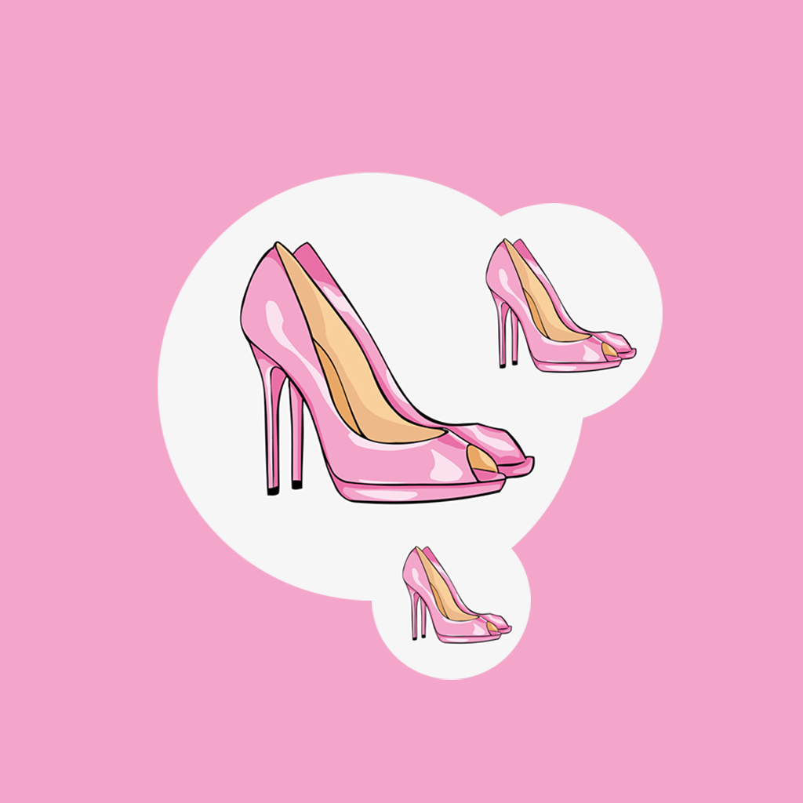

## 欢迎来到 我的高跟鞋分类存放记录

日常生活中我们穿的高跟鞋经常会有不同类型和功能，需要我们分类存放，方便我们日常使用和鞋子的保护。例如冬装的高跟鞋、夏装的高跟鞋我们的使用频率和季节都不一样，包括清洗方式等。我们可以将这些高跟鞋分类好，可以记录我们家里的高跟鞋的使用情况，清洗次数,距离最近清洗的时间，鞋子的用途和存放位置等。这样我们就能清楚我们家里的高跟鞋的具体情况，是否需要清洗等，方便我们生活中使用。

如果您遇到什么需要解答的问题，请发送您的问题到以下邮箱。

我们将第一时间为您解答。

### 邮箱地址: zhanghesongyuan7@126.com

谢谢！
